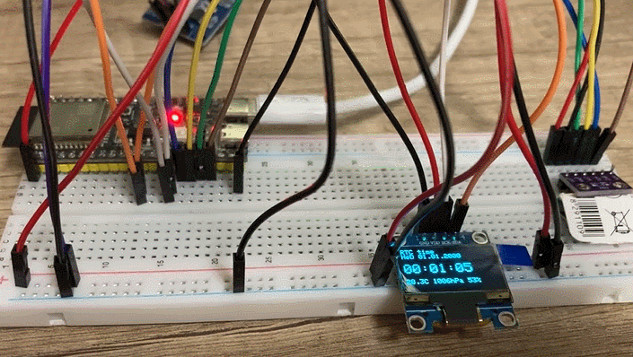

# ESP32 Learning Project

This is a small educational project for the [Embedded Development course](https://beetroot.academy/courses/online/kurs-embedded-development)


## Scheme
```
ESP32-S3

                    +----------------------+
3.3V ---------------|                      |
                    |      ESP32-S3        |
GPIO9 --------------|                      |
GPIO8---------------|                      |
                    |                      |
                    |                      |
                    |                      |
                    |                      |
                    |                      |
GND ----------------|                      |
                    +----------------------+


RTC

+--------+
|   RTC  |-- SCL ----> GPIO 9
|        |-- SDA ----> GPIO 8
|        |-- VCC ----> 3.3V
|        |-- GND ----> GND
+--------+


LCD SSD1306-Revision 1.1

+--------+
|  LCD   |-- SCK ----> GPIO 9
|        |-- SDA ----> GPIO 8
|        |-- VDD ----> 3.3V
|        |-- GND ----> GND
+--------+


```
LCD

| №  | Дія                    | Команда | Значення |
| -- | ---------------------- | ------- | -------- |
| 1  | Display OFF            | `0xAE`  | —        |
| 2  | Enable charge pump     | `0x8D`  | `0x14`   |
| 3  | Set MUX Ratio          | `0xA8`  | `0x3F`   |
| 4  | Set Display Offset     | `0xD3`  | `0x00`   |
| 5  | Set Display Start Line | `0x40`  | —        |
| 6  | Set Segment Remap      | `0xA1`* | —        |
| 7  | Set COM Scan Direction | `0xC8`* | —        |
| 8  | Set Contrast           | `0x81`  | `0x7F`   |
| 9  | Entire Display OFF     | `0xA4`  | —        |
| 10 | Normal Display         | `0xA6`  | —        |
| 11 | Set Oscillator         | `0xD5`  | `0x80`   |
| 12 | Set COM Pins           | `0xDA`  | `0x02`   |
| 13 | Display ON             | `0xAF`  | —        |


## Result



If GIF preview is not displayed in your viewer, open it directly: [result.gif](./result.gif)
